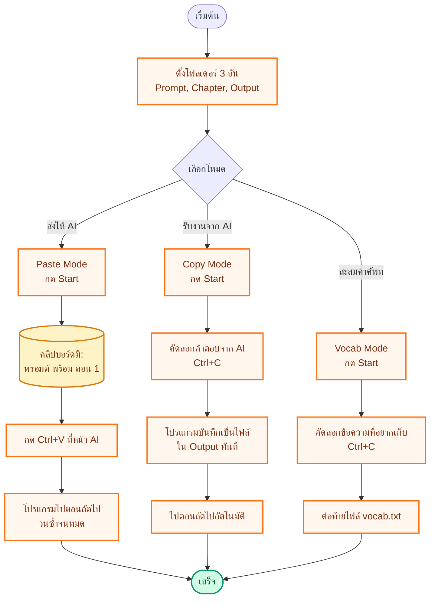

# INKCOPY

โปรแกรมคลิปบอร์ดอัจฉริยะสำหรับนักเขียน/นักแปล — ช่วยทำงานซ้ำ ๆ ระหว่าง "พรอมต์ + ตอน" กับ ChatGPT/AI ให้กลายเป็นกดปุ่มเดียวจบ

วางพรอมต์ + ตอนนิยายในโฟลเดอร์ → กดปุ่ม → โปรแกรมจะวางให้อัตโนมัติ → กด Ctrl+V ทีเดียวไปตอนถัดไป

---

## สารบัญ

1. [เริ่มต้นใช้งาน](#เริ่มต้นใช้งาน)
2. [3 โหมดหลัก — ใช้ทำอะไร](#3-โหมดหลัก--ใช้ทำอะไร)
3. [โฟลเดอร์ต่าง ๆ — วางไฟล์อะไรที่ไหน](#โฟลเดอร์ต่าง-ๆ--วางไฟล์อะไรที่ไหน)
4. [ขั้นตอนภาพรวม](#ขั้นตอนภาพรวม)
5. [โหมด 1 — Paste Mode (วาง)](#โหมด-1--paste-mode-วาง)
6. [โหมด 2 — Copy Mode (คัดลอก)](#โหมด-2--copy-mode-คัดลอก)
7. [โหมด 3 — Vocab Mode (คำศัพท์)](#โหมด-3--vocab-mode-คำศัพท์)
8. [ปุ่มลัด (Hotkey)](#ปุ่มลัด-hotkey)
9. [การตั้งค่าต่าง ๆ บนหน้าจอ](#การตั้งค่าต่าง-ๆ-บนหน้าจอ)
10. [แก้ปัญหาที่พบบ่อย](#แก้ปัญหาที่พบบ่อย)

---

## เริ่มต้นใช้งาน

### บนเครื่อง Windows

1. ดาวน์โหลด **`INKCOPY.exe`** จาก [หน้าดาวน์โหลด](https://github.com/snibzyz/inkcopy/releases/latest)
2. วางที่ไหนก็ได้ในเครื่อง (ไม่ต้องติดตั้ง — เป็นไฟล์เดียวจบ)
3. ดับเบิลคลิกเปิด
4. ถ้ามีแถบเตือนของ Windows → กด **More info** → **Run anyway**

### บนเครื่อง Mac

1. ดาวน์โหลด **`INKCOPY-v0.2.0.dmg`** จาก [หน้าดาวน์โหลด](https://github.com/snibzyz/inkcopy/releases/latest)
2. ดับเบิลคลิกเปิด → ลาก **`INKCOPY.app`** ไปยังโฟลเดอร์ Applications
3. **ครั้งแรก**: คลิกขวาที่ไอคอน → **Open** → กด **Open** อีกครั้ง (ครั้งต่อไปดับเบิลคลิกได้ปกติ)
4. **สำคัญมาก** — ให้สิทธิ์ Accessibility:
   - เปิด **System Settings** → **Privacy & Security** → **Accessibility**
   - กดเครื่องหมาย **+** เพิ่ม INKCOPY แล้วเปิดสวิตช์
   - **Quit แอป → เปิดใหม่** (สิทธิ์เพิ่งให้จะมีผลก็ต่อเมื่อเริ่มแอปใหม่)
   - ในหน้าต่าง INKCOPY ดู **แถบ Hotkey ใต้สถานะ** — ถ้าเป็น 🟢 = ใช้ได้, ถ้า 🔴 = ดู [แก้ปัญหาที่พบบ่อย](#แก้ปัญหาที่พบบ่อย)

> เมื่อมีเวอร์ชันใหม่ ปุ่มสีเขียว **⬆ vX.X.X** จะโผล่ที่มุมขวาบน — กดแล้วเลือก **Install Now** เพื่อโหลดและติดตั้งให้อัตโนมัติ (Windows: NSIS installer · Mac: เปิด .dmg ให้ลาก)

---

## 3 โหมดหลัก — ใช้ทำอะไร

INKCOPY มี 3 โหมด สลับกันด้วยปุ่มใหญ่ด้านบน

| โหมด | ทำอะไร | เหมาะกับ |
|---|---|---|
| **Paste Mode (วาง)** | อ่านไฟล์พรอมต์ + ตอน รวมเข้าด้วยกัน วางลงคลิปบอร์ดให้พร้อมกดวาง | ส่งงานให้ AI ทีละตอน ทำซ้ำหลายร้อยตอน |
| **Copy Mode (คัดลอก)** | รอรับข้อความที่คัดลอก แล้วบันทึกลงไฟล์ทันที | เก็บคำตอบจาก AI กลับเป็นไฟล์ตอน .txt |
| **Vocab Mode (คำศัพท์)** | รอรับข้อความ แล้วต่อท้ายลงไฟล์เดียว | สะสมคำศัพท์/อ้างอิงระหว่างทำงาน |

กดปุ่มโหมดด้านบนเพื่อสลับ (วน Paste → Copy → Vocab → Paste)

---

## โฟลเดอร์ต่าง ๆ — วางไฟล์อะไรที่ไหน

INKCOPY ไม่ได้สร้างโฟลเดอร์ของตัวเอง — **คุณเลือกได้เอง** ว่าจะใช้โฟลเดอร์ไหน

### 3 โฟลเดอร์ที่ต้องตั้ง

| โฟลเดอร์ | วางไฟล์อะไร | ใช้ในโหมด |
|---|---|---|
| **Prompt Folder** | ไฟล์พรอมต์ที่จะส่งให้ AI ก่อนเนื้อหา (เช่น "กรุณาแปลภาษาจีนเป็นไทยให้ลื่นไหล...") | Paste |
| **Chapter Folder** | ไฟล์เนื้อหาตอนนิยาย แต่ละไฟล์ = 1 ตอน | Paste, Copy |
| **Output Folder** | โฟลเดอร์ปลายทาง — โปรแกรมจะบันทึกผลลงที่นี่ | Copy, Vocab |

### ชนิดไฟล์ที่อ่านได้

- `.txt` — ไฟล์ข้อความธรรมดา
- `.md` — ไฟล์มาร์กดาวน์
- `.lnk` — ทางลัด Windows (ชี้ไปไฟล์อื่น โปรแกรมจะตามให้อัตโนมัติ)

### ที่เก็บการตั้งค่า (ไม่ต้องแตะ)

- **Windows**: `%APPDATA%\INKCOPY\config.json`
- **Mac**: `~/Library/Application Support/INKCOPY/config.json`

ค่าโฟลเดอร์ + โหมดล่าสุด + ความเร็ว จะถูกจำไว้ — เปิดครั้งหน้าได้เลย

---

## ขั้นตอนภาพรวม

ขั้นตอนทำงานทั่วไป จากต้นจนจบ



> สีส้ม = สิ่งที่คุณกด · สีเหลือง = สิ่งที่อยู่ในคลิปบอร์ด · สีเขียว = เสร็จ

---

## โหมด 1 — Paste Mode (วาง)

**ใช้ทำอะไร**: ส่งงานให้ AI ทีละตอน โดยรวม "พรอมต์ + ตอน" เป็นข้อความเดียว แล้ววางลงคลิปบอร์ดให้พร้อมกด Ctrl+V

### ขั้นตอนใช้งาน

1. **กดปุ่ม "📁 Prompt Folder"** → เลือกโฟลเดอร์ที่มีพรอมต์
   - หรือกด **"📄 Files…"** เลือกหลายไฟล์โดยตรง
   - กด **"➕ เพิ่ม"** ถ้าอยากเพิ่มอีกทีหลังโดยไม่ลบของเดิม
2. **กดปุ่ม "📁 Chapter Folder"** → เลือกโฟลเดอร์ที่มีตอนนิยาย
3. ไฟล์ทั้งหมดจะเรียงตามชื่อ (ตอน 001, 002, ... อัตโนมัติ)
4. **กรอง/เลือกตอน** (ไม่บังคับ):
   - **"ตอนที่: From – To"** → เลือกช่วงที่จะทำ เช่น 1–50
   - **"ไปตอนที่:"** → กระโดดไปตอนเลขที่กรอก
5. **กด "▶ Start"** ที่ด้านล่าง — คลิปบอร์ดจะมีพรอมต์ + ตอนแรกพร้อม
6. ไปที่หน้า AI → กด **Ctrl+V** (Windows) หรือ **Cmd+V** (Mac) → โปรแกรมจะไปตอนถัดไปทันที
7. รอ AI ตอบ → กด Ctrl+V อีกครั้งสำหรับตอนถัดไป → วนแบบนี้จนหมด

### ตัวเลือกการวาง

**"นิยาย (Chapter) วางเป็น:"**
- **ไฟล์** — วางเป็นไฟล์แนบ (เหมาะกับ ChatGPT ที่รับไฟล์ได้)
- **ข้อความ** — วางเป็นข้อความล้วน (เหมาะกับช่องแชตทั่วไป)

**"Chapters per paste:"** — กดปุ่ม + / − ปรับจำนวน
- ตั้ง 1 = ส่งทีละตอน (แนะนำ)
- ตั้ง 3 = รวมพร้อมกัน 3 ตอนต่อ 1 ครั้ง

### ขั้นตอนแบบภาพ


---

## โหมด 2 — Copy Mode (คัดลอก)

**ใช้ทำอะไร**: รอจังหวะที่คุณคัดลอกข้อความ (เช่น คำตอบของ AI) แล้วบันทึกลงไฟล์ตอนใน Output Folder ทันที — ใช้คู่กับ Paste Mode เพื่อ "ส่ง-รับ-ส่ง-รับ" ทีละตอน

### ขั้นตอนใช้งาน

1. **กดปุ่ม "📁 Chapter Folder"** → เลือกโฟลเดอร์ตอนต้นทาง (ใช้ชื่อไฟล์ตามนี้)
2. **กดปุ่ม "📁 Output Folder"** → เลือกโฟลเดอร์ที่จะบันทึก
3. กดสลับเป็น **Copy Mode** (ปุ่มใหญ่ด้านบน เปลี่ยนเป็นสีน้ำเงิน)
4. **กด "▶ Start"**
5. ที่หน้า AI → คัดลอกคำตอบ (**Ctrl+C** / **Cmd+C**)
6. โปรแกรมจะบันทึกข้อความเป็นไฟล์ในชื่อตอนถัดไปทันที (เช่น `Chapter 001.txt`, `Chapter 002.txt`, ...)
7. ไปต่อตอนถัดไปได้เลย

### ตัวเลือกเสริม

**"Content at line:"** — กดปุ่ม + / − ปรับ
- ตั้ง 1 = บันทึกข้อความตั้งแต่บรรทัดแรก
- ตั้ง 3 = เว้น 2 บรรทัดก่อน แล้วค่อยใส่เนื้อหา (เผื่อเอาชื่อตอนต่อหัวเอง)

---

## โหมด 3 — Vocab Mode (คำศัพท์)

**ใช้ทำอะไร**: เก็บคำศัพท์/ข้อมูล/อ้างอิงต่าง ๆ ระหว่างทำงาน — ทุกครั้งที่กด Ctrl+C จะต่อท้ายลงไฟล์เดียวเรื่อย ๆ

### ขั้นตอนใช้งาน

1. **กดปุ่ม "📁 Output Folder"** → เลือกโฟลเดอร์ที่จะเก็บ
2. **กรอกชื่อไฟล์** ที่ช่อง "Vocab file:" — ค่าเริ่มต้น `vocab.txt`
3. กดสลับเป็น **Vocab Mode**
4. **กด "▶ Start"**
5. คัดลอกข้อความที่อยากเก็บ (Ctrl+C) — ข้อความใหม่จะถูกต่อท้ายไฟล์เดิม
6. กดอีก → ต่อท้ายอีก ทำได้เรื่อย ๆ จนกว่าจะกด Stop

ใช้ได้ดีเวลาไล่อ่านเนื้อหาแล้วเจอคำศัพท์ใหม่ ๆ อยากเก็บไว้รวมไว้ที่เดียว

---

## ปุ่มลัด (Hotkey)

ปุ่มลัดทำงานได้ทั่วระบบ — ไม่ต้องเปิดหน้าต่าง INKCOPY ค้างไว้

| ปุ่ม | ทำอะไร |
|---|---|
| **F9** | ย้อนกลับไปตอนก่อนหน้า |
| **F10** | ข้ามไปตอนถัดไป |
| **F12** | หยุดชั่วคราว / ทำงานต่อ (Pause/Resume) |
| **Ctrl+V** (Win) / **Cmd+V** (Mac) | Paste Mode — วางแล้วไปตอนถัดไป |
| **Ctrl+C** (Win) / **Cmd+C** (Mac) | Copy / Vocab Mode — บันทึกแล้วไปตอนถัดไป |

> Mac ต้องให้สิทธิ์ Accessibility ก่อน ไม่งั้นปุ่มลัดไม่ทำงาน

---

## การตั้งค่าต่าง ๆ บนหน้าจอ

```
┌─────────────────────────────────────────────────┐
│  INKCOPY               ⬆ v0.2.0    −  ✕         │  ← แถบบน (อัปเดต/ย่อ/ปิด)
├─────────────────────────────────────────────────┤
│  [ 📋 PASTE MODE  Prompt+Chapter → Clipboard ]  │  ← ปุ่มสลับโหมด
├─────────────────────────────────────────────────┤
│  -- Select folders first --                     │  ← สถานะ
├─────────────────────────────────────────────────┤
│  📁 Prompt Folder  📄 Files…  ➕ เพิ่ม    --    │  ← ตั้งโฟลเดอร์พรอมต์
│  ┌─ Prompt files ────────────────────────┐      │
│  │ ☑ prompt-01.txt    (วางเป็น: ไฟล์)    │      │
│  │ ☑ prompt-02.md     (วางเป็น: ข้อความ) │      │
│  └────────────────────────────────────────┘     │
│                                                  │
│  📁 Chapter Folder  📄 Files…  ➕ เพิ่ม   --    │  ← ตั้งโฟลเดอร์ตอน
│  ตอนที่: [From] – [To]  ✓ Apply  ↺ Reset       │  ← ช่วงตอน
│  ไปตอนที่: [    ]                                │  ← กระโดดไปตอน
│  นิยาย (Chapter) วางเป็น: ( ) ไฟล์  (•) ข้อความ │
│                                                  │
│  📁 Output Folder                          --    │  ← โฟลเดอร์ปลายทาง
│  Vocab file: [ vocab.txt ]                       │  ← ชื่อไฟล์คำศัพท์
│  Chapters per paste:  −  1  +                    │  ← จำนวนตอนต่อครั้ง
│  Content at line:     −  1  +                    │  ← บรรทัดเริ่มเขียน
│                                                  │
│  🔄 Fetch  ⏸ Pause  ▶ Start                    │  ← ปุ่มควบคุม
└─────────────────────────────────────────────────┘
```

### ปุ่มควบคุมด้านล่าง

| ปุ่ม | ทำอะไร |
|---|---|
| **🔄 Fetch** | สแกนโฟลเดอร์ใหม่ (ถ้าเพิ่มไฟล์ลงไประหว่างทำงาน) |
| **⏸ Pause** | หยุดชั่วคราว — กดอีกครั้งจะกลายเป็น ▶ Resume |
| **▶ Start** | เริ่มทำงานในโหมดที่เลือก |

---

## แก้ปัญหาที่พบบ่อย

| ปัญหา | วิธีแก้ |
|---|---|
| Windows ขึ้นแถบเตือนสีน้ำเงิน | กด **More info** → **Run anyway** (ครั้งแรกครั้งเดียว) |
| Mac บอกว่าเปิดไม่ได้ / damaged | คลิกขวาที่ไอคอน → **Open** → **Open** (อย่าดับเบิลคลิก) |
| **Mac: Cmd+V ไม่ขยับตอน (แต่ปุ่ม Next ในแอปขยับได้)** | ดูแถบ Hotkey ใต้สถานะในแอป — ถ้าเห็น 🔴 **Accessibility: NOT trusted** = macOS เปิดสวิตช์ไว้แต่จริง ๆ ไม่ trust binary (เจอบ่อยหลังอัปเดต) **แก้: System Settings → Privacy & Security → Accessibility → กด `−` ลบ INKCOPY ออก → กด `+` เพิ่มใหม่ → เปิดสวิตช์ → Quit แอป (Right-click ที่ Dock → Quit) → เปิดใหม่** |
| Mac: แถบ Hotkey เป็น 🔴 Listener DEAD | แอปจะลอง restart ให้เอง แต่ถ้ายังตาย → ดู log ผ่านปุ่ม **🔍 Open Log** ในแอป แล้วส่งให้เรา |
| Windows: ปุ่มลัดไม่ตอบสนอง | บางโปรแกรม (เกม / Remote Desktop) ดักปุ่มลัดอยู่ ลองปิดก่อน หรือเปิด INKCOPY แบบ **Run as administrator** |
| กด Ctrl+V แล้วไม่ไปตอนถัดไป | ตรวจว่ายังอยู่ในโหมด Paste และไม่ได้กด ⏸ Pause ค้างไว้ · ดูแถบ Hotkey ว่า 🟢 alive และ pastes เพิ่มขึ้นเมื่อกด Cmd+V |
| คัดลอก (Ctrl+C) แล้วไม่บันทึก | ตรวจว่าอยู่ใน Copy/Vocab Mode และตั้ง Output Folder แล้ว |
| ไฟล์ `.lnk` (ทางลัด Windows) ไม่ทำงาน | INKCOPY ใช้ PowerShell อ่านทางลัด — ตรวจว่า PowerShell ไม่ถูกบล็อก |
| ตั้งค่าหายหลังเปิดใหม่ | ลองเช็คว่ามีสิทธิ์เขียน `%APPDATA%\INKCOPY\` (Win) หรือ `~/Library/Application Support/INKCOPY/` (Mac) |

### Diagnostics + Log

ตั้งแต่ v0.2.0 INKCOPY มี:

- **แถบ Hotkey** ใต้สถานะหลัก — แสดงสุขภาพของ key listener real-time (🟢/🟡/🔴) + นับ keys / V keys / pastes ที่ตรวจจับได้
- **ปุ่ม 🔍 Open Log** — เปิดโฟลเดอร์ log ในระบบ
- **Log file**:
  - macOS: `~/Library/Logs/INKCOPY/inkcopy.log`
  - Windows: `%APPDATA%\INKCOPY\inkcopy.log`
  - Linux: `~/.config/INKCOPY/inkcopy.log`

ถ้าเจอปัญหา hotkey — เปิด log file → ดูบรรทัด `[ERROR]` หรือ `mod down` / `V key seen` ว่าระบบรับ event เข้ามาหรือไม่

---

## ข้อกำหนดเครื่อง

- ใช้ได้บน Windows 10/11 หรือ macOS (ทั้งชิป M1/M2/M3/M4 และ Intel)
- ไม่ต้องลง Python หรือโปรแกรมเสริมใด ๆ — เป็นไฟล์เดียวจบ
- ใช้แบบไม่ต่อเน็ตได้ — ต้องต่อเน็ตเฉพาะตอนเช็คอัปเดต

---

## ลิขสิทธิ์

MIT — ใช้ได้เสรี
